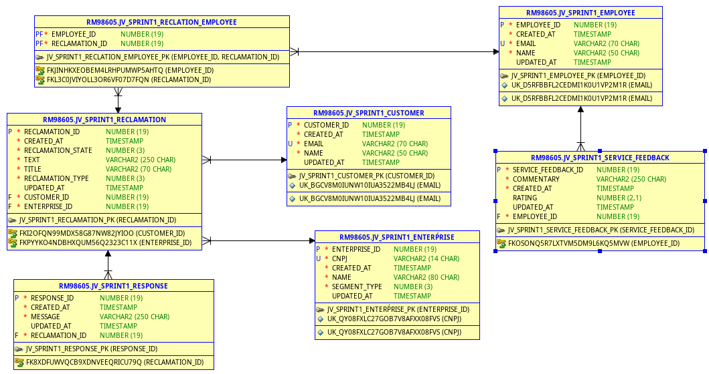
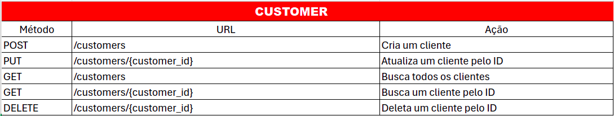

# Java-Plusoft
API for customer complaints whitelabel

## Colaboradores:

- Diogo Gallina – RM98605
- Pedro Archila – RM55
- Pedro Couto - RM
- Rafael Kanfler - RM
- João Dubas - RM 

## Objetivo:

O objetivo principal deste projeto é mitigar os conflitos entre os objetivos da nossa iniciativa de avaliação da satisfação do cliente e as distintas formas de entrada de dados provenientes das diversas empresas atendidas pela Plusoft, que abrangem uma variedade de setores industriais. Reconhecendo a necessidade de padronização dos dados recebidos pelo nosso modelo de avaliação, concebemos uma solução inovadora: o desenvolvimento de uma API para ser implementada como um serviço whitelabel em todas as empresas parceiras.

Essa API tem como finalidade centralizar e padronizar o processo de submissão de reclamações, direcionando-as de forma eficiente para a Plusoft. Ao fornecer um portal unificado para a gestão de reclamações, visamos otimizar a experiência do cliente e fortalecer a relação com nossos parceiros comerciais através dos nossos modelos de dados que visam entregar dados de satisfação dos clientes gerando feedbacks mais precisos. 

## Modelo de Entidade e Relacionamento (DER):

## Rotas:

### CUSTOMER:

### Link do repositório
https://github.com/orgs/Hal9000-Fiap/repositories
